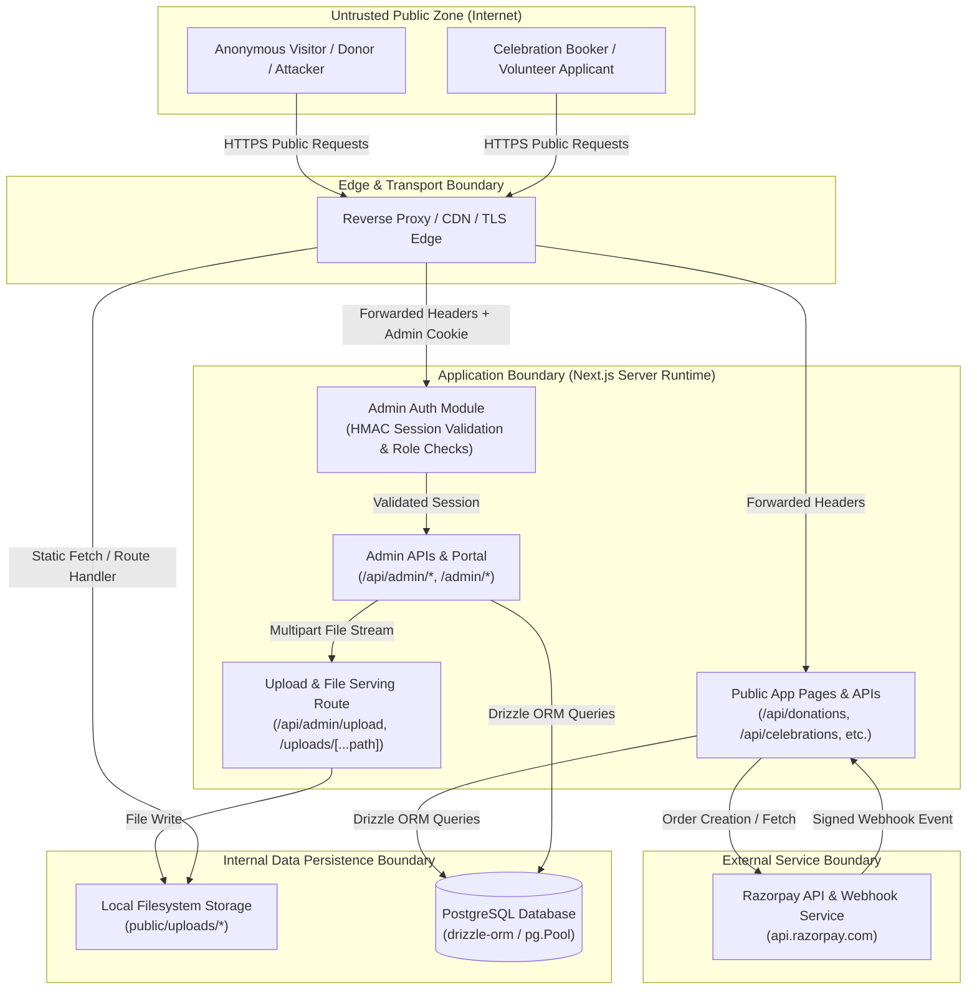
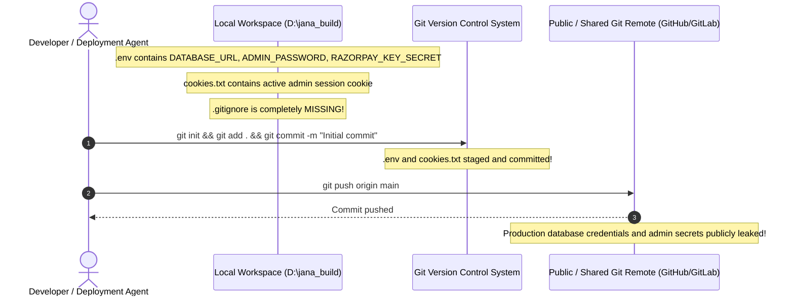

# Janaseva Ashrama Platform — Threat Model

**Document Status:** Final Audit Assessment  
**Application:** Janaseva Ashrama (Bangalore, India)  
**Architecture:** Next.js 16.2.6 (App Router + Turbopack SSR), TypeScript, PostgreSQL (via Drizzle ORM & `pg.Pool`), Razorpay Payment Gateway, Local Upload Storage  
**Target Standard:** STRIDE Threat Modeling & OWASP Top 10 (2021/2025)  
**Audit Date:** October 2026  

---

## 1. Executive Summary

This threat model identifies and analyzes the security boundaries, key assets, threat actors, attack vectors, and existing vs. missing defenses of the Janaseva Ashrama donor, campaign, celebration, and content management platform. 

The platform facilitates real-world charitable donations (INR), 80G tax receipt issuance, Special Day celebration meal sponsorships, public fundraising campaigns, corporate CSR partnerships, volunteer applications, and child/resident impact reporting on Magadi Road, Bangalore. 

Security evaluations demonstrate robust core payment integrity controls (atomic state transitions, HMAC signature verification, server-side pricing recalculation, and CSV formula sanitization). However, critical gaps exist in access control boundaries (absence of global middleware, RBAC bypasses on CRM/export and celebrations), client-spoofable IP rate limiting, unverified payment status assignment on public celebration bookings, lack of `.gitignore` leading to credential exposure risks, and public unmasked display of Indian Permanent Account Numbers (PAN).

---

## 2. Asset Inventory & Classification

Assets are categorized by confidentiality, integrity, and availability impact:

| Asset Classification | Asset Description | Data Sensitivity | Storage Location | Impact if Compromised |
| :--- | :--- | :--- | :--- | :--- |
| **Financial & Payment Integrity** | Razorpay order IDs, payment IDs, capture states, transaction amounts, idempotency keys, receipt numbers | **High Integrity** | `donations`, `donation_lines`, Razorpay Dashboard | Financial loss, fraudulent receipt issuance, tax evasion claims, chargebacks |
| **Donor PII & Tax Identifiers** | Full names, email addresses, phone numbers, delivery preferences, dedication messages | **Confidential** | `donations.donor_*`, `celebration_bookings.donor_*`, `volunteer_applications` | Privacy violation, phishing targeting donors, reputational harm |
| **Statutory Tax Identifiers (PAN)** | Indian Permanent Account Numbers (10-character alphanumeric PAN) used for 80G tax deductions | **Strict Confidentiality** | `donations.meta->donorPan`, `celebration_bookings.donorPan` | Regulatory non-compliance (DPDP Act 2023, IT Act 2000), identity theft |
| **Child Safeguarding & Resident Media** | Resident photos, video stories, wish greeting videos, meal celebration proof photos | **High Safeguarding** | `public/uploads/*`, `media_assets`, `media_consents`, `celebration_bookings.*_proof_url` | Child dignity violation, exploitation, legal liability under POCSO/JJ Act |
| **Administrative Credentials & Secrets** | `ADMIN_SESSION_SECRET`, `ADMIN_PASSWORD`, `ADMIN_EMAIL`, `DATABASE_URL`, `RAZORPAY_KEY_SECRET`, `RAZORPAY_WEBHOOK_SECRET` | **Critical Confidentiality** | `.env`, server runtime memory | Total platform takeover, database dump, payment manipulation |
| **Content & Platform Authenticity** | Published stories, today's updates, impact metrics, governance audit reports, 80G registration certificates | **High Integrity** | `content_entries`, `today_updates`, `impact_metrics`, `documents` | Public deception, defacement, loss of public trust in NGO |
| **System Availability** | Next.js server runtime, PostgreSQL connection pool, local disk storage | **High Availability** | Node.js process, PostgreSQL instance | Denial of service, inability to accept donations during peak festival campaigns |

---

## 3. Trust Boundaries & Data Flow Architecture

### 3.1 Trust Boundaries Diagram



### 3.2 Boundary Definitions

1. **Boundary 1 (Public Client ↔ Next.js Server):** Unauthenticated network perimeter. All inputs (JSON payloads, query parameters, multipart form data, HTTP headers) are completely untrusted.
2. **Boundary 2 (Next.js Server ↔ Admin Subsystem):** Authenticated perimeter guarded by the `janaseva_admin_session` HTTP cookie. Session IDs must exist in the `admin_sessions` table and signatures must match `ADMIN_SESSION_SECRET`.
3. **Boundary 3 (Next.js Server ↔ Razorpay Gateway):** External perimeter. Outgoing calls authenticate via HTTP Basic Auth using `RAZORPAY_KEY_ID:RAZORPAY_KEY_SECRET`. Incoming webhooks authenticate via HMAC-SHA256 signature in `x-razorpay-signature` verified against `RAZORPAY_WEBHOOK_SECRET`.
4. **Boundary 4 (Next.js Server ↔ PostgreSQL Database):** Internal data perimeter. Authenticated over TLS or localhost via `DATABASE_URL`. Managed through Drizzle ORM parameterized queries.
5. **Boundary 5 (Next.js Server ↔ Local File Storage):** Filesystem storage perimeter located in `public/uploads/`. Files are written via Node.js `fs/promises` and served via `/uploads/[...path]` route or static file handler.

---

## 4. Threat Actors & Capabilities

| Threat Actor | Motivation | Capabilities | Access Level |
| :--- | :--- | :--- | :--- |
| **Unauthenticated Internet Attacker** | Financial theft, data exfiltration, service disruption, defacement | Automated scanning, payload injection, spoofed IP headers, brute forcing, credential stuffing | External network access to public routes (`/api/*`, `/*`) |
| **Malicious Donor / Customer** | Fake donation receipts, unpaid celebration bookings, social engineering | Modifying client-side requests, tampering with payload parameters, replay attacks | Valid client interaction with payment and booking flows |
| **Compromised Lower-Role Staff / Admin** | Unauthorized data access, privilege escalation, internal theft | Valid credentials for lower roles (`VOLUNTEER_ADMIN`, `MEDIA_REVIEWER`, `CONTENT_ADMIN`) | Access to admin panel with authenticated cookie |
| **Disgruntled Insider / Former Contributor** | Data leakage, sabotaging donor relations, leaking child media | Prior knowledge of architecture, potential access to git repositories or backup files | Internal access or historical code/secret visibility |
| **Rogue / Malicious Webhook Sender** | Fabricating paid transactions to generate valid 80G tax receipts | Emulating Razorpay webhook notifications | Ability to send HTTP POST to `/api/razorpay/webhook` |

---

## 5. Entry Points & Attack Vectors

| Entry Point | Protocol / Method | Primary Attack Vectors |
| :--- | :--- | :--- |
| `/api/donations` | `POST` (JSON) | Cart manipulation, negative custom amounts, parameter tampering, rate-limit exhaustion |
| `/api/donations/verify` | `POST` (JSON) | Signature forgery, payment ID replay, status tampering, order mismatch |
| `/api/donations/demo-complete` | `POST` (JSON) | Bypassing payment gateway in production to create fake confirmed receipts |
| `/api/celebrations` | `POST` (JSON) | Blind injection of `paymentStatus: "paid"`, unverified booking confirmation, XSS in blessing message |
| `/api/celebrations` | `GET` | Harvesting child celebration proof image URLs |
| `/api/razorpay/webhook` | `POST` (Raw JSON) | Replay of captured payment events, forged webhook signatures, amount mismatch exploits |
| `/api/admin/login` | `POST` (JSON) | Credential brute-forcing, timing attacks, empty-credential fallback authentication bypass |
| `/api/admin/upload` | `POST` (Multipart) | Malicious file upload (SVG XSS, polyglot files), directory traversal, disk exhaustion |
| `/uploads/[...path]` | `GET` | Path traversal (`../`), unauthorized access to private celebration/proof assets |
| `/receipt/[publicId]` | `GET` (SSR) | Enumeration of public donation IDs to scrape donor names, masked emails, and unmasked PANs |
| `/certificate/[reference]` | `GET` (SSR) | Following "Back to receipt" link to expose donor PANs from publicly shared certificates |
| `/api/admin/crm/donations` | `GET` (JSON) | BFLA/IDOR by lower-privileged admin accounts to harvest donor PII and PAN numbers |
| `/api/admin/crm/export` | `GET` (CSV) | Mass PII exfiltration without role verification or audit trail logging |
| Next.js Image Optimizer `/_next/image` | `GET` | Server-Side Request Forgery (SSRF) / DoS due to wildcard `remotePatterns: [{ hostname: "**" }]` |

---

## 6. STRIDE Threat Analysis

### 6.1 Spoofing (Identity & Origin)

| Threat ID | Threat Description | Likelihood | Impact | Severity | Existing Mitigation | Missing Mitigation |
| :--- | :--- | :--- | :--- | :--- | :--- | :--- |
| **STRIDE-S1** | **Client IP Spoofing via `X-Forwarded-For`**<br/>Attacker rotates `X-Forwarded-For` header to bypass in-memory rate limiting across all endpoints. | High | Medium | **High** | Rate limits exist via `rateLimit()` in `src/lib/server-utils.ts`. | `clientIp()` trusts untrusted header: `req.headers.get("x-forwarded-for")?.split(",")[0]`. No trusted proxy validation or cloud edge rate limiting. |
| **STRIDE-S2** | **Admin Authentication Bypass via Empty Environment Variables**<br/>If `ADMIN_EMAIL` and `ADMIN_PASSWORD` are unset, empty string input matches empty environment strings. | Medium | Critical | **Critical** | `timingSafeEqual()` is utilized to prevent timing attacks. | `loginAdmin()` in `src/lib/admin-auth.ts` does not assert that configured credentials are non-empty strings before evaluating match. |
| **STRIDE-S3** | **Webhook Forgery**<br/>Attacker sends fake `payment.captured` webhooks to mark donations as paid. | Low | Critical | **Low** | `webhookSignatureValid()` strictly computes HMAC-SHA256 with `RAZORPAY_WEBHOOK_SECRET` and validates via `safeEqualHex()`. | None; control is correctly implemented. |

### 6.2 Tampering (Data Integrity)

| Threat ID | Threat Description | Likelihood | Impact | Severity | Existing Mitigation | Missing Mitigation |
| :--- | :--- | :--- | :--- | :--- | :--- | :--- |
| **STRIDE-T1** | **Unverified Payment Status Injection in Celebrations**<br/>Attacker posts `{ paymentStatus: "paid" }` to `/api/celebrations`. Server stores it directly as paid without payment gateway interaction. | High | High | **High** | Basic input sanitization via `clean()` and phone normalization via `normalizePhone()`. | Server blindly accepts `paymentStatus` from user input (line 31 & 72 in `src/app/api/celebrations/route.ts`) and sets `celebrationStatus: "CONFIRMED"`. |
| **STRIDE-T2** | **Donation Cart Amount Tampering**<br/>Attacker attempts to tamper with item prices in the donation cart payload. | High | Critical | **Low** | Server re-queries `impactItems` from database and recalculates `unitPrice * qty` server-side (lines 49–78 of `/api/donations/route.ts`). | None; control is correctly implemented. |
| **STRIDE-T3** | **Payment Signature Tampering on Checkout Completion**<br/>Attacker tampers with `razorpay_signature` in `/api/donations/verify`. | High | Critical | **Low** | `checkoutSignatureValid` validates HMAC-SHA256(`orderId|paymentId`, `RAZORPAY_KEY_SECRET`), verifies status from Razorpay API, and ensures amount match in paise. | None; control is correctly implemented. |

### 6.3 Repudiation (Audit & Traceability)

| Threat ID | Threat Description | Likelihood | Impact | Severity | Existing Mitigation | Missing Mitigation |
| :--- | :--- | :--- | :--- | :--- | :--- | :--- |
| **STRIDE-R1** | **Unlogged Mass CRM Donor PII Exfiltration**<br/>A compromised admin account downloads full donor database with PANs via `/api/admin/crm/export`. | Medium | High | **High** | `requireAdminApi()` requires an active session cookie. | `/api/admin/crm/export` and `/api/admin/crm/donations` do NOT write to `auditLogs`. No trace of who accessed or exported PII is preserved. |
| **STRIDE-R2** | **Unlogged Celebration Record Deletions**<br/>Admin deletes celebration bookings via `DELETE /api/admin/celebrations?id=...`. | Medium | Medium | **Medium** | Authentication required. | No audit record created in `auditLogs` for celebration modifications or deletions. |

### 6.4 Information Disclosure (Confidentiality & Privacy)

| Threat ID | Threat Description | Likelihood | Impact | Severity | Existing Mitigation | Missing Mitigation |
| :--- | :--- | :--- | :--- | :--- | :--- | :--- |
| **STRIDE-I1** | **Public Exposure of Donor Permanent Account Numbers (PAN)**<br/>Public receipt page displays full unmasked PAN (`Donor PAN: XXXXX1234X`). Public certificate links directly to receipt page. | High | High | **High** | Metadata robots tag set to `noindex, follow: false`. Email is masked (`maskEmail`). | Full PAN is printed in cleartext on `/receipt/[publicId]`. Certificate page `/certificate/[reference]` provides direct link to `/receipt/[publicId]`. |
| **STRIDE-I2** | **Broken Function-Level Authorization (BFLA) on CRM Endpoints**<br/>Lower-tier admins (`MEDIA_REVIEWER`, `CONTENT_ADMIN`, `VOLUNTEER_ADMIN`) can access full donor PII and PANs. | Medium | High | **High** | `requireAdminApi()` restricts unauthenticated visitors. | `requireAdminApi()` is called without role parameters in `src/app/api/admin/crm/donations/route.ts` and `src/app/api/admin/crm/export/route.ts`. |
| **STRIDE-I3** | **Unprotected Root Secrets and Missing `.gitignore`**<br/>`.env` (310 bytes) and `cookies.txt` (135 bytes) reside in project root without a `.gitignore` file. | High | Critical | **Critical** | None in repository configuration. | Missing `.gitignore`. High risk of committing production secrets and admin session cookies to version control. |

### 6.5 Denial of Service (Availability)

| Threat ID | Threat Description | Likelihood | Impact | Severity | Existing Mitigation | Missing Mitigation |
| :--- | :--- | :--- | :--- | :--- | :--- | :--- |
| **STRIDE-D1** | **In-Memory Rate Limiter Eviction / Memory Consumption**<br/>Attacker sends thousands of unique IP keys to exhaust memory in `buckets` Map. | Medium | Medium | **Medium** | Memory ceiling pruning exists: when `buckets.size > 5000`, expired buckets are deleted. | In-memory limiter is not shared across multi-process or cluster deployments. Resets on process restart. |
| **STRIDE-D2** | **Wildcard Image Optimization DoS / SSRF**<br/>Attacker requests `/_next/image?url=https://malicious-slow-host/img.png&w=1200&q=75`. | Medium | High | **High** | Next.js built-in image caching. | `next.config.ts` line 33 specifies `remotePatterns: [{ protocol: "https", hostname: "**" }]`. Permits fetching from arbitrary remote servers. |
| **STRIDE-D3** | **Local Storage Disk Exhaustion via Uploads**<br/>Admin account uploads repeated 50MB video files to `public/uploads/`. | Low | High | **Medium** | Upload route restricted to authenticated admins; 50MB per file limit. | No total storage quota, rate limiting on uploads, or external object storage (e.g. S3 / Cloud Storage). |

### 6.6 Elevation of Privilege (Authorization)

| Threat ID | Threat Description | Likelihood | Impact | Severity | Existing Mitigation | Missing Mitigation |
| :--- | :--- | :--- | :--- | :--- | :--- | :--- |
| **STRIDE-E1** | **Absence of Global Middleware Security Perimeter**<br/>No `src/middleware.ts` exists. Authorization relies entirely on individual route handler discipline. | Medium | High | **High** | Each current page and API handler explicitly invokes `requireAdminPage()` or `requireAdminApi()`. | A developer adding a new page or route under `/admin/*` or `/api/admin/*` that omits the guard will leave the route completely public. |
| **STRIDE-E2** | **Role Confusion Across Admin APIs**<br/>Inconsistent role enforcement across administrative endpoints. | Medium | High | **High** | Specific routes (`campaigns`, `documents`, `metrics`, `today-updates`, `volunteers`, `media`, `impact-items`) enforce strict role arrays. | Routes for `celebrations`, `crm/donations`, `crm/export`, `site-content`, and `analytics` do not enforce role arrays, allowing any role full control. |

---

## 7. Attack Scenarios

### Scenario A: Unverified Special Day Booking Exploitation
```mermaid
sequenceDiagram
    autonumber
    actor Attacker as Attacker (Public)
    participant API as /api/celebrations (POST)
    participant DB as PostgreSQL (celebration_bookings)
    participant Admin as Staff Admin Dashboard

    Attacker->>API: POST { celebrantName: "Attacker", amount: 10000, paymentStatus: "paid" }
    Note over API: Input parsed; paymentStatus accepted blindly from JSON body
    API->>DB: INSERT celebration_bookings (paymentStatus: "paid", celebrationStatus: "CONFIRMED")
    DB-->>API: Row Created
    API-->>Attacker: HTTP 200 { ok: true, reference: "JA-CELEB-..." }
    Admin->>API: GET /api/admin/celebrations
    API-->>Admin: Returns Booking with celebrationStatus="CONFIRMED", paymentStatus="paid"
    Note over Admin: Kitchen prepares food and staff schedules celebration for unpaid booking!
```

### Scenario B: Accidental Version Control Exposure of Root Secrets


---

## 8. Summary of Existing vs. Missing Mitigations

### 8.1 Existing Mitigations (Implemented & Verified)
- **Parameterized SQL Queries:** Drizzle ORM strictly enforces parameterized queries, preventing SQL injection.
- **Payment Signature Cryptography:** Razorpay checkout signatures and webhooks are cryptographically validated using HMAC-SHA256 and constant-time comparison (`timingSafeEqual`).
- **Server-Side Pricing Control:** Donation totals are recalculated strictly using database prices in `impactItems`, ignoring client amounts for catalog items.
- **Atomic Payment Transition:** `donations` rows transition from `created` to `paid` using atomic `WHERE status = 'created'` update clauses to prevent duplicate payments.
- **Path Traversal Protection on Uploads:** `src/app/uploads/[...path]/route.ts` resolves canonical paths against `uploadsBaseDir` and verifies prefix matching.
- **CSV Formula Injection Sanitization:** `src/app/api/admin/crm/export/route.ts` prefixes `=`, `+`, `-`, `@`, `\t`, `\r` with `'` to prevent spreadsheet command execution.
- **Strict File Extension Whitelisting:** `src/app/api/admin/upload/route.ts` allows only whitelisted extensions for images, videos, and documents.
- **Transport Security Headers:** `next.config.ts` configures `HSTS`, `X-Frame-Options: SAMEORIGIN`, `X-Content-Type-Options: nosniff`, and `Permissions-Policy`.
- **Child Safeguarding Consent Model:** Database schema and media API support formal consent tracking (`mediaConsents` with `PENDING`, `CONSENTED`, `RESTRICTED`, `REVOKED`).

### 8.2 Missing Mitigations (Gaps Identified)
- **Centralized Middleware Guard:** No `src/middleware.ts` to enforce uniform session checks on `/admin/*` and `/api/admin/*`.
- **Role-Based Access Control on CRM & Celebrations:** `requireAdminApi()` called without role arrays on CRM donations, exports, site content, and celebrations.
- **Client IP Verification:** `clientIp()` trusts unverified `x-forwarded-for` headers, making rate limiting easily bypassable.
- **Protection Against Empty Admin Credentials:** `loginAdmin()` does not reject authentication attempts when `ADMIN_EMAIL` or `ADMIN_PASSWORD` are blank in environment variables.
- **Repository Secret Exclusion:** Missing `.gitignore` leaves `.env` and `cookies.txt` vulnerable to accidental commit.
- **PAN Masking & Separation:** Donor PANs are stored in plaintext and rendered unmasked on public receipt pages.
- **Payment Verification on Celebrations:** `/api/celebrations` accepts client-provided payment status without payment gateway verification.
- **Global Content Security Policy (CSP):** No global CSP configured in `next.config.ts`.
- **Image Optimization Domain Restrictions:** Wildcard `remotePatterns` allows Next.js image proxying to arbitrary hosts.
